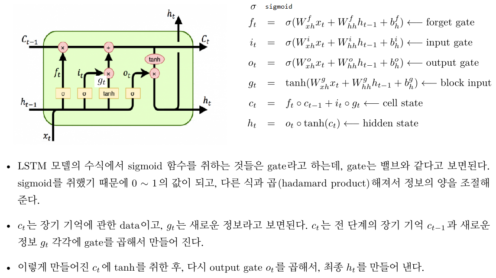

# Tensorflow에서 RNN관련 API의 사용법에 대해 알아보자.

## Introduction
- 먼저 tensorflow에서는 rnn cell(e.g. tf.keras.layers.SimpleRNN)과 rnn(e.g. tf.keras.layers.RNN)을 구분하고 있다.
- rnn cell이 있고, 이 rnn cell을 연결하여 layer로 만든 것이 rnn이다. cell을 묶어 놓음으로써 time step을 batch로 처리 가능한다.


- RNN의 각 time step의 입력 data는 [batch_size, input_dim]=[N,D]형태이지만, 모든 time_step(즉 seq_length만큼)을 모아, [batch_size, seq_length, input_dim]=[N,T,D] shape(형태)으로 만들어 넣어준다. 
- batch로 묶인 data의 sequence길이가 다른 경우에는 padding을 통해, 같은 길이로 맞추는 과정이 필요하다.
- data가 embedding으로 변환되기 전에는 [batch_size, seq_length] 형태(shape)를 가지는데, embedding을 통해, [batch_size, seq_length, input_dim] 형태로 변환된다.
```
import tensorflow as tf

batch_size = 3
seq_length = 5
input_dim = 7
hidden_dim = 4

rnn_cell = tf.keras.layers.LSTMCell(hidden_dim)  # RNN Cell
rnn = tf.keras.layers.RNN(rnn_cell,return_sequences=True) # RNN

initial_state =  rnn.get_initial_state(inputs)  # RNN의 initial state를 0으로 만든다. [batch_size, hidden_dim]

inputs = tf.random.normal([batch_size, seq_length, input_dim])  # Embedding을 거친 data라 가정.
output = rnn(inputs,initial_state)

```
- inital_state는 주로 0으로 만들기도 하고, 다른 정보가 있으면 넣을 수도 있다. inital_state의 shape은 [batch_size, hidden_dim].
- `return_sequences=True`로 하면, [batch_size, seq_length, hidden_dim] shape의 output이 return 된다..
- `return_sequences=False`로 했을 때는 마지막 sequence의 값이 [batch_size, hidden_dim] 형태로 return 된다.

======================================================================================================================================================================


## LSTM & GRU
- Vanilla RNN은 hidden state에 그 전 모든 time step의 정보를 압축하여 다음 step으로 전달하는 구조이다.
- LSTM, GRU는 직전 time step의 정보와 더 장기적인(이전 time step 모두) 정보를 현재 time step에 전달할 수 있도록 모델 구조가 설계되어 있다. 
- Vanilla RNN은 hidden state만으로 구성된 반면, LSTM은 hidden state(short term memory)와 장기 기억 전달을 목적으로 하는 cell state(long term memory) 2개로 구성되어 있다.

- Tensorflow에서 LSTM은 다음과 같이 사용할 수 있다.
```
cell = tf.keras.layers.LSTMCell(hidden_dim)
rnn = tf.keras.layers.RNN(cell,return_sequences=True)
```
또는 
```
rnn = tf.keras.layers.LSTM(4,return_sequences=True, return_state=True, name='encoder')
```


======================================================================================================================================================================


## Multi-Layer RNN

- Multi Layer는 cell을 여러개 겹친 후, RNN에 넘겨주면 된다.
```
cells = [tf.keras.layers.LSTMCell(hidden_dim),tf.keras.layers.LSTMCell(hidden_dim*2)]
rnn = tf.keras.layers.RNN(cells,return_sequences=True)
``` 
- RNN Layer를 단순히 연결하지 않고, RNN Layer사이에 Dense Layer, BatchNormalization, Dropout을 넣어야 하는 경우는 다음과 같이 처리하면 된다.
- layer들을 연결하기 위해 `tf.keras.models.Sequential`을 사용하면 된다.
```
import tensorflow as tf

# LSTM + BN + LSTM + FC
batch_size = 3
seq_length = 5
input_dim = 7
hidden_dim = 9
output_size = 11  

lstm_layer1 = tf.keras.layers.RNN(tf.keras.layers.LSTMCell(hidden_dim),return_sequences=True)
lstm_layer2 = tf.keras.layers.RNN(tf.keras.layers.LSTMCell(hidden_dim),return_sequences=True) 
    
model = tf.keras.models.Sequential([lstm_layer1, tf.keras.layers.BatchNormalization(),lstm_layer2, tf.keras.layers.Dense(output_size)])

inputs = tf.random.normal([batch_size, seq_length, input_dim])
outputs = model(inputs,training=True)
print(outputs) 
```


======================================================================================================================================================================

### Bidirectional RNN
```
import tensorflow as tf

batch_size = 3
seq_length = 5
input_dim = 7
hidden_dim = 2

rnn = tf.keras.layers.Bidirectional(tf.keras.layers.LSTM(hidden_dim, return_sequences=True,return_state=True))

inputs = tf.random.normal([batch_size, seq_length, input_dim])
outputs, f_h, f_c, b_h, b_c = rnn(inputs)  # SimpleRNN: output, f_h, b_h           LSTM: output, f_h,f_c, b_h, b_c

print(outputs)
```

