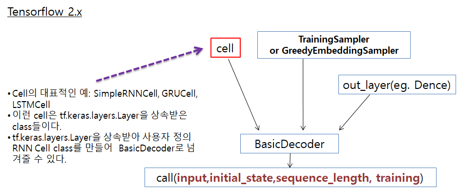
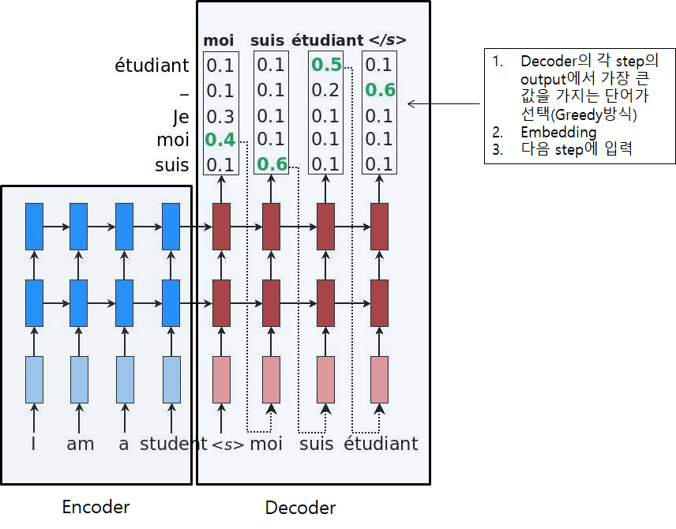
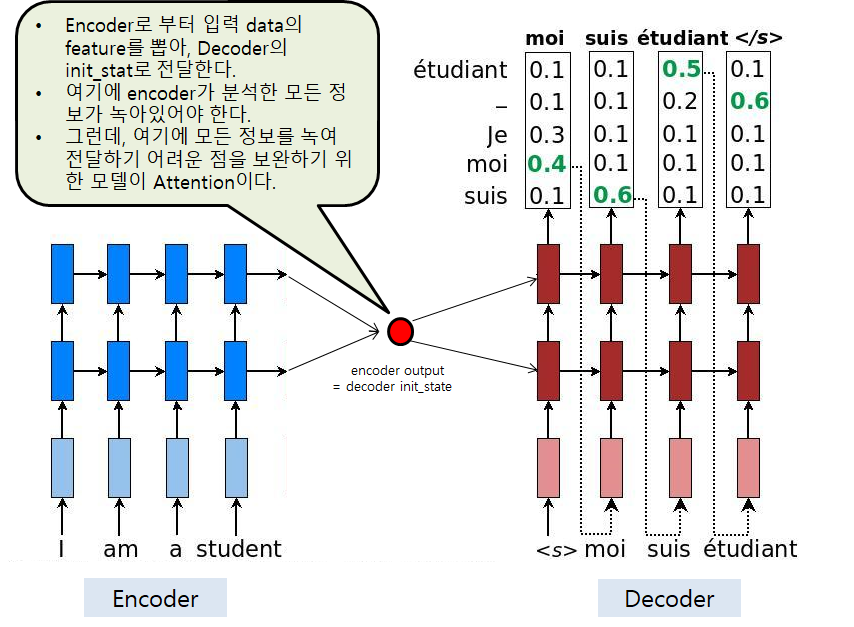

# Tensorflow Addons, Encoder-Decoder & Attention

## Tensorflow Addons
```
pip install tensorflow-addons
```

```
import tensorflow as tf
import tensorflow_addons as tfa
```

- Addons에는 Tensorlow의 핵심 API에서 사용할 수 없는 기능을 추가적으로 구현되여 모여있다. Tensorflow 1.x 버전에서는 tensorflow.contrib가 이런 역할을 했다.
- Addons API에서 RNN관련 API로 `tfa.seq2seq`가 있다. 
	* tfa.seq2seq.BasicDecoder
	* tfa.seq2seq.TrainingSampler, tfa.GreedyEmbeddingSampler
	* tfa.seq2seq.dynamic_decode
- tensorflow 1.x의 contrib에 같은 기능을 하는 API가 있다.
	* tf.contrib.seq2seq.BasicDecoder
	* tf.contrib.seq2seq.TrainingHelper,   tf.contrib.seq2seq.GreedyEmbeddingHelper
	* tf.contrib.seq2seq.dynamic_decode


## Sampler
- Tensorflow 1.x에서는 Helper로 불렸다. time step t에서의 input, output으로 부터 다음 step의 input을 어떻게 만들것인가를 제어하는 역할을 한다.
- training 단계: `tfa.seq2seq.TrainingSampler`는 teacher forcing 방식으로 입력 data를 만든다. teacher forcing은 주어진 입력 data를 모델에 그대로 전달하는 방식이다.
- Test 단계: `tfa.GreedyEmbeddingSampler`는 첫번째 time step의 입력만 주어지면, 모델의 output으로 부터 다음 time step의 입력 data를 Greedy 방식으로 생성한다.
- Greedy 방식이란, output의 argmax값으로 다음 입력값을 정하는 방식이다.
- 다음 `tfa.seq2seq.BasicDecoder, tfa.seq2seq.TrainingSampler`를 이용하여 loss까지 계산하는 코드이다. tensorflow 1.x와 대비해 보았을 때, `dynamic_decode`가 없다. `dynamic_decode`를 사용할 수도 있기는 한다.
```
import numpy as np
import tensorflow as tf
import tensorflow_addons as tfa


vocab_size = 6  # [SOS_token, 1, 2, 3, 4, EOS_token]
SOS_token = 0
EOS_token = 5

x_data = np.array([[SOS_token, 3, 1, 4, 3, 2],[SOS_token, 3, 4, 2, 3, 1],[SOS_token, 1, 3, 2, 2, 1]], dtype=np.int32)
y_data = np.array([[3, 1, 4, 3, 2,EOS_token],[3, 4, 2, 3, 1,EOS_token],[1, 3, 2, 2, 1,EOS_token]],dtype=np.int32)
print("data shape: ", x_data.shape)


output_dim = vocab_size
batch_size = len(x_data)
hidden_dim =7

seq_length = x_data.shape[1]
embedding_dim = 8

embedding = tf.keras.layers.Embedding(vocab_size, embedding_dim,trainable=True) 

inputs = embedding(x_data)

# Decoder
decoder_cell = tf.keras.layers.LSTMCell(hidden_dim)

#init_state = [tf.zeros((batch_size,hidden_dim)), tf.ones((batch_size,hidden_dim))]   # (h,c)
init_state = decoder_cell.get_initial_state(inputs=None, batch_size=batch_size, dtype=tf.float32)
    
projection_layer = tf.keras.layers.Dense(output_dim)

sampler = tfa.seq2seq.sampler.TrainingSampler()  # alias ---> sampler = tfa.seq2seq.TrainingSampler()

decoder = tfa.seq2seq.BasicDecoder(decoder_cell, sampler, output_layer=projection_layer)
outputs, last_state, last_sequence_lengths = decoder(inputs,initial_state=init_state, sequence_length=[seq_length]*batch_size,training=True)


logits = outputs.rnn_output  #(batch_size, seq_length, vocab_size)

print(logits.shape)


weights = tf.ones(shape=[batch_size,seq_length])
target = tf.convert_to_tensor(y_data)
loss = tfa.seq2seq.sequence_loss(logits,target,weights)  # logit: (batch_size, seq_length, vocab_size),        target, weights: (batch_size, seq_length)

print('loss: ', loss.numpy())
```
- train이 끝난 후, test를 위해서는 `tfa.GreedyEmbeddingSampler`를 사용하면 된다.

```
sampler = tfa.seq2seq.GreedyEmbeddingSampler()
decoder = tfa.seq2seq.BasicDecoder(decoder_cell, sampler, output_layer=projection_layer,maximum_iterations=seq_length)
outputs, last_state, last_sequence_lengths = decoder(embedding.weights,initial_state=init_state,
                                  start_tokens=tf.tile([SOS_token], [batch_size]), end_token=EOS_token,training=False)   
```
- 위 코드에서는 첫번째 time step의 입력으로 [S0S_token]을 batch_size만큼 만들어서 넣어주고 있다. `GreedyEmbeddingSampler`를 이용해서 sequence를 생성해 나가는 데, EOS_token을 만들 때까지 생성하게 하고 있다.
- 그런데, EOS_token을 모델이 만들지 못하면 무한히 sequence를 생성할 수도 있기 때문에, 이를 방지하기 위해 `BasicDecoder`에서 `maximum_iterations`를 지정해 주고 있다.
- `GreedyEmbeddingSampler`는 randomness가 없기 때문에, output의 결과는 batch_size 만큼 동일하다.

## Encoder-Decoder Model
- Encoder-Decoder Model은 seq2seq로도 불린다.
- Image Captioning, NMT(번역), TTS, STT등에서 Encoder-Decoder Model이 사용된다.
	* Image Captioning에서는 Image를 Encoder에서 처리하고, Decoder가 Imag를 설명하는 문장을 생성한다.
	* 영어-한글 번역 NMT 문제에서는 영어를 Encoder로 처리하고, Decoder가 번역된 한글 문장을 생성하는 역할을 한다.  
	* TTS에서는 주어진 문장을 음성으로 변환해야 하는데, text로된 문장을 Encoder가 처리하고 Decoder가 음성을 생성하는 역할을 한다.


- Encoder-Decoder 구조를 Tensorflow로 구현하기 위해서는 `tf.keras.layers.RNN`으로 Encoder를 구현하면 되고, `tfa.seq2seq.BasicDecoder`를 사용하여 Decoder를 만들면 된다.
- 다음은 간단한 구조의 Encoder-Decoder 코드이다. Encoder, Decoder의 각 입력값을 각각 Embedding을 거친 값으로 가정했다.

```
import tensorflow as tf

batch_size = 3
encoder_length = 5
encoder_input_dim = 7
hidden_dim = 4

encoder_cell = tf.keras.layers.LSTMCell(hidden_dim)  # RNN Cell
encoder = tf.keras.layers.RNN(encoder_cell,return_sequences=False) # RNN


encoder_inputs = tf.random.normal([batch_size, encoder_length, encoder_input_dim])  # Embedding을 거친 data라 가정.


encoder_outputs = encoder(encoder_inputs) # encoder의 init_state을 명시적으로 전달하지 않으면, zero값이 들어간다.  ===> (batch_size, hidden_dim)


decoder_length = 10
decoder_input_dim = 7
decoder_cell = tf.keras.layers.LSTMCell(hidden_dim)  # RNN Cell
decoder = tf.keras.layers.RNN(encoder_cell,return_sequences=True) # RNN


decoder_inputs = tf.random.normal([batch_size, decoder_length, decoder_input_dim])  # Embedding을 거친 data라 가정.
initial_state =  [encoder_outputs,encoder_outputs]  # (h,c)모두에 encoder_outputs을 넣었다.

decoder_outputs = decoder(decoder_inputs, initial_state)
print(decoder_outputs)


```
- 위 코드에서 `encoder_outputs`이 Decoder의 init_state가 되면 된다.


