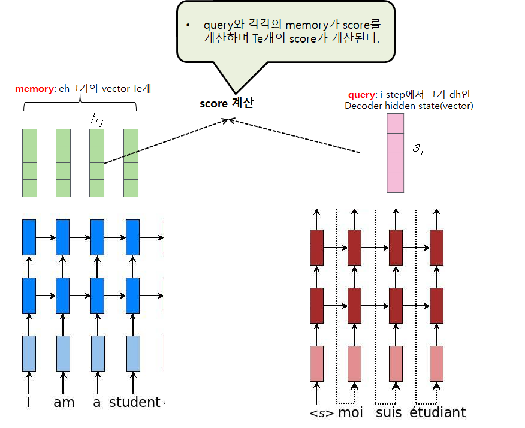
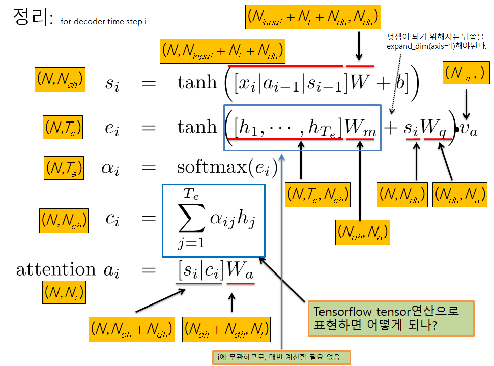

# Attention

## Attention이란
- Attention은 Encoder의 마지막 hidden state에 모든 정보를 압축하는 방식의 단점을 보완하기 위한 기법이다.
- Attention은 Encder의 모든 time step에서의 출력을 Decoder에 전달하는 방식이다. 이 Encoder의 모든 출력을 Memory(또는 Key)라 부른다.

	- N: batch_size,
	- Te: Encoder sequence Length
	- eh, dh: Encoder Hidden Dim, Decoder Hidden dim
- Encoder의 모든 hidden state, 즉 Memory는 [N,Te,eh]형태를 가진다. 이 memory는 eh크기의 vector가 Te개 있다고 보면된다. 
- Decoder의 time step i에서의 hidden state를 Query라 부른다. 이 Query는 [N,dh] 형태이다. 
- Te개의 Memory vector 각각과 Query간에 score라는 것을 계산하고 나면, score는 모두 Te개가 된다. 이 score를 계산하는 방식에는 여러 Attention 모델이 있다.
	* Dot Product Attention: memory vector와 query를 단순 내적하여 score를 계산한다. 내적을 위해서는 eh=dh가 되어야 한다.
	* Luong Attention: Dot Product Attention을 좀 더 일반화. 
	* Bahdanau Attention
- score에 softmax를 취하면 합이 1이 되는 확률로 볼 수 있는데, 이것을 alignment라 한다. 
- 이 alignment로 Memory vector들을 가중평균(weighted sum)하면 [N,eh] 크기의 vector가 만들어진다. 이 vector를 context라 부른다.
- 다시 context를 가공하여 Attention vector를 만든다. 다시 말해, Attention은 context로 부터 얻어지는데, 가공하지 않고 그대로 사용하기도 한다.

- 이제 score을 어떻게 계산하는지 자세히 살펴보자. score는 Decoder의 hidden state s_i와 Encoder의 hiddens state h_j간의 연산이다. encoder의 hidden state가 Te개 이므로, {score(s_i,h_j)}가 계산된다.

	* Dot Product Attention: 위에서 언급한 대로, Encoder, Decoder hidden state간의 내적이다. 내적이 되기 위해서는 Encoder, Decoder hidden state dimension이 일치해야 한다.
	* Luong Attention: Dot Product Attention은 hidden state간의 dimension이 일치할 때만 가능하다. 이런 제약조건을 극복하기 위해 중간에 행렬(Y_a)을 하나 끼워, 곱이 가능할 수 있도록 하는 방식이다. 행렬 Y_a의 크기는 (eh x dh).
	* Bahdanau Attention: 좀 더 복잡한 방식으로 score 계산이 이뤄어진다. 먼저 v_a vector의 크기를 결정하기 위한 hyperparameter N_a가 정해져 있어야 한다. 
	그리고, N_l이 없으며, context가 attention이 되고, N_a가 주어져 있는 경우에는 연산이 한번 더 이루어진다.
	* Normalize = True/False에 따라, score에 대한 normalization 적용 여부가 결정된다.

- [참고] Tensorflow 내부에서 Attention이 계산되는 과정과 shape의 변화는 다음과 같다. 실제 계산과정에서는 batch로 처리되고 broadcasting 과정도 거친다.
