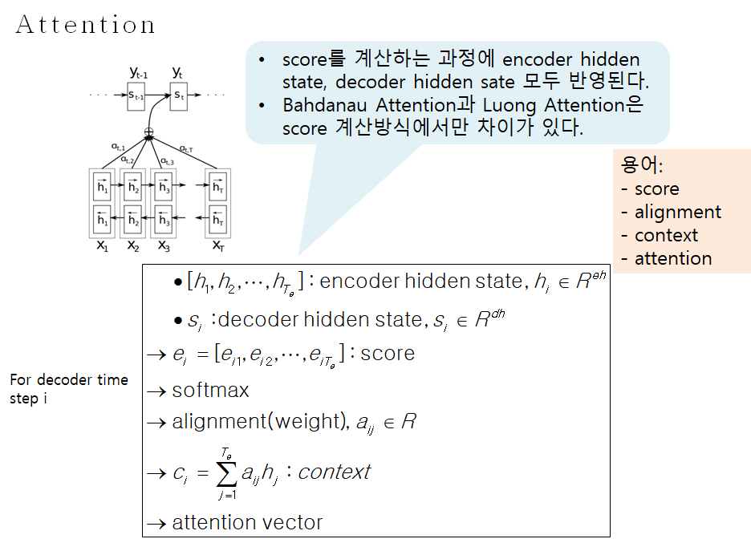

# Attention

## Attention이란
- Attention은 Encoder의 마지막 hidden state에 모든 정보를 압축하는 방식의 단점을 보완하기 위한 기법이다.
- Attention은 Encder의 모든 time step에서의 출력을 Decoder에 전달하는 방식이다. 이 Encoder의 모든 출력을 Memory라 부른다.

	- N: batch_size,
	- Te: Encoder sequence Length
	- De: Encoder Hidden Dim
- Encoder의 모든 hidden state, 즉 Memory는 [N,Te,De]형태를 가진다. 이 memory는 De크기의 vector가 Te개 있다고 보면된다. 
- Decoder의 time step j에서의 hidden state는 Query라 부른다. 이 Query는 [N,Dd] 형태이다. 
- Te개의 Memory vector 각각과 Query간에 score라는 것을 계산하고 나면, score는 모두 Te개가 된다.

