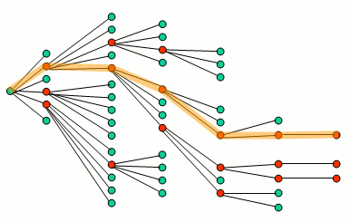

# BeamSearchDecoder & Sampler

## Beam Search란
- train단계가 아니고, inference 단계에서 사용하는 기법이다.
- decoder의 각 step에서 출력값은 softmax를 취한 확률이고, 이 확률 중에서 가장 높은 값을 선택(argmax)하여 다음 step의 input으로 feeding한다. 이러한 방식을 Greedy Search라고 하다.
- Greedy Search를 좀 더 확장한 방식이 Beam Search라도 할 수 있는데, Beam Search는 search beam 또는 beam width(e.g 3)을 먼저 정한 후, search beam만큼의 복수개를 선택하여 다음 단계로 넘어간다.
- 번역 모델같은 것에서는 정답이 1개만 있는 것이 아니기 때문에 선택의 가능성을 넓혀줄 수 있다.

- Encoder 없이 Decoder만 있는 Simple은 대표적인 모델로 [minimal-character model](https://gist.github.com/karpathy/d4dee566867f8291f086)이 있다. 이 모델을 더욱 단순화하여 train 후, Beam Search로 test해 보자.
- 입력 data는 "hello"만 있다. character는 모두 6개이다. 
```
SOS_token = 0
EOS_token = 5
index_to_char = {SOS_token: '<S>', 1: 'h', 2: 'e', 3: 'l', 4: 'o', EOS_token: '<E>'}
x_data = np.array([[SOS_token, 1, 2, 3, 3, 4]], dtype=np.int32)
y_data = np.array([[1, 2, 3, 3, 4,EOS_token]],dtype=np.int32)
```

- 다음 코드에서 `decoder_type = 1` 또는 `decoder_type = 2`를 지정하면, Greey Search 또는 Beam Search가 이루어진다.
```
import numpy as np
import tensorflow as tf
import tensorflow_addons as tfa


vocab_size = 6
SOS_token = 0
EOS_token = 5


index_to_char = {SOS_token: '<S>', 1: 'h', 2: 'e', 3: 'l', 4: 'o', EOS_token: '<E>'}
x_data = np.array([[SOS_token, 1, 2, 3, 3, 4]], dtype=np.int32)
y_data = np.array([[1, 2, 3, 3, 4,EOS_token]],dtype=np.int32)

output_dim = vocab_size
batch_size = len(x_data)
hidden_dim =7

seq_length = x_data.shape[1]
embedding_dim = 8


embedding = tf.keras.layers.Embedding(vocab_size, embedding_dim,trainable=True) 


target = tf.convert_to_tensor(y_data)

# Decoder

# single layer RNN
decoder_cell = tf.keras.layers.LSTMCell(hidden_dim)

# decoder init state:
init_state = decoder_cell.get_initial_state(inputs=None, batch_size=batch_size, dtype=tf.float32)
    
projection_layer = tf.keras.layers.Dense(output_dim)

sampler = tfa.seq2seq.sampler.TrainingSampler()  # alias ---> sampler = tfa.seq2seq.TrainingSampler()
decoder = tfa.seq2seq.BasicDecoder(decoder_cell, sampler, output_layer=projection_layer)

optimizer = tf.keras.optimizers.Adam(lr=0.01)

for step in range(200):
    with tf.GradientTape() as tape:
        inputs = embedding(x_data)
        outputs, last_state, last_sequence_lengths = decoder(inputs,initial_state=init_state, sequence_length=[seq_length]*batch_size,training=True)
        logits = outputs.rnn_output
        
        weights = tf.ones(shape=[batch_size,seq_length])
        loss = tfa.seq2seq.sequence_loss(logits,target,weights)
    
    trainable_variables = embedding.trainable_variables + decoder.trainable_variables   # 매번 update되어야 한다.
    grads = tape.gradient(loss,trainable_variables)
    optimizer.apply_gradients(zip(grads,trainable_variables))
    
    if step%10==0:
        print(step, loss.numpy())

# Train 완료!!! Test 시작.
sample_batch_size = 2

decoder_type = 2
if decoder_type==1:
    # GreedyEmbeddingSampler
    sampler = tfa.seq2seq.GreedyEmbeddingSampler()  # alias ---> sampler = tfa.seq2seq.sampler.GreedyEmbeddingSampler
    decoder = tfa.seq2seq.BasicDecoder(decoder_cell, sampler, output_layer=projection_layer,maximum_iterations=seq_length)

    init_state = decoder_cell.get_initial_state(inputs=None, batch_size=sample_batch_size, dtype=tf.float32)

    
else:
    # Beam Search
    beam_width=2
    decoder = tfa.seq2seq.BeamSearchDecoder(decoder_cell,beam_width,output_layer=projection_layer,maximum_iterations=seq_length)
    

    init_state = tfa.seq2seq.tile_batch(decoder_cell.get_initial_state(inputs=None, batch_size=sample_batch_size, dtype=tf.float32),multiplier=beam_width)
    
outputs, last_state, last_sequence_lengths = decoder(embedding.weights,initial_state=init_state,
                                                     start_tokens=tf.tile([SOS_token], [sample_batch_size]), end_token=EOS_token,training=False) 

if decoder_type==1:
    result = tf.argmax(outputs.rnn_output,axis=-1).numpy()
    
    print(result)
    for i in range(sample_batch_size):
        print(''.join( index_to_char[a] for a in result[i] if a != EOS_token))

else:
    result = outputs.predicted_ids.numpy()
    print(result.shape)
    for i in range(sample_batch_size):
        print(i,)
        for j in range(beam_width):
            print(''.join( index_to_char[a] for a in result[i,:,j] if a != EOS_token))
```

## 다양한 Sampler
- 지금까지 `tfa.seq2seq.sampler.TrainingSampler`, `tfa.seq2seq.GreedyEmbeddingSampler`만 보았다. 좀 더 다양한 Sampler를 살펴보자.
	* `tfa.seq2seq.SampleEmbeddingSampler`: inference에서 `GreedyEmbeddingSampler` 대신 사용할 수 있다. `GreedyEmbeddingSampler`는 argmax로 sampling이 되지만, `SampleEmbeddingSampler`는 확률에 따라 sampling한다. 이런 sampling 방식을 categorical sampling이라 한다.
	* `tfa.seq2seq.ScheduledEmbeddingTrainingSampler`: train에서 사용. train단계에서 teacher forcing 방식과 GreeyEmbedding 방식을 `sampling_probability`에 따라 혼용.
```
sampler = tfa.seq2seq.sampler.ScheduledEmbeddingTrainingSampler(sampling_probability=0.2)
outputs, last_state, last_sequence_lengths = decoder(..., embedding=embedding.weights)
```

	* `tfa.seq2seq.ScheduledOutputTrainingSampler`: ScheduledEmbeddingTrainingSampler와 같은 방식이지만, embedding하는 부분이 없다. sampling_probability로 logit이 (embedding과정 없이) 다음 input이 되거나, 주어진 data가 그대로 다음 step의 입력값이 된다.


