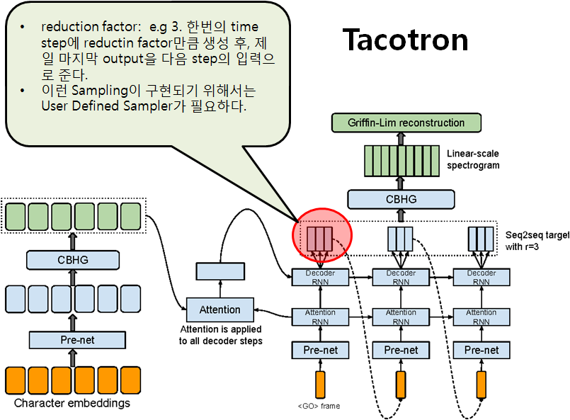

# User Defined Sampler

## tfa.seq2seq.InferenceSampler
```
sampler = tfa.seq2seq.InferenceSampler(sample_fn = lambda outputs: tf.argmax(outputs, axis=-1, output_type=tf.int32), 
                                       sample_shape=[], sample_dtype=tf.int32,
                                       end_fn = lambda sample_ids: tf.equal(sample_ids, EOS_token),
                                       next_inputs_fn = lambda ids: tf.nn.embedding_lookup(embedding.weights, ids))
```
- `tfa.seq2seq.InferenceSampler`를 정의하면서, 다음 argument를 넣어주어야 한다.
	* sample_fn: time step의 outputs로 부터, sample ids을 어떻게 추출할 것인가?
	* end_fn: sequence 생성 종료 조건.
	* next_inputs_fn: 전 time step의 outputs로 부터, 다음 step의 input을 어떻게 만들 것인가?
- decoder의 첫번재 argument로 SOS_token을 embedding해서 넣어주어야 한다. 
```
start_inputs = tf.nn.embedding_lookup(embedding.weights, tf.tile([SOS_token], [sample_batch_size]))  # embedding된 것을 넘겨주어야 한다.
outputs, last_state, last_sequence_lengths = decoder(start_inputs,initial_state=init_state,training=False) 
```

- 다음은 전체 코드이다.
```
vocab_size = 6
SOS_token = 0
EOS_token = 5

# x_data = np.array([[SOS_token, 3, 1, 4, 3, 2],[SOS_token, 3, 4, 2, 3, 1],[SOS_token, 1, 3, 2, 2, 1]], dtype=np.int32)
# y_data = np.array([[3, 1, 4, 3, 2,EOS_token],[3, 4, 2, 3, 1,EOS_token],[1, 3, 2, 2, 1,EOS_token]],dtype=np.int32)
# print("data shape: ", x_data.shape)


index_to_char = {SOS_token: '<S>', 1: 'h', 2: 'e', 3: 'l', 4: 'o', EOS_token: '<E>'}
x_data = np.array([[SOS_token, 1, 2, 3, 3, 4]], dtype=np.int32)
y_data = np.array([[1, 2, 3, 3, 4,EOS_token]],dtype=np.int32)


output_dim = vocab_size
batch_size = len(x_data)
hidden_dim =7

seq_length = x_data.shape[1]
embedding_dim = 8

init = np.arange(vocab_size*embedding_dim).reshape(vocab_size,-1)

embedding = tf.keras.layers.Embedding(vocab_size, embedding_dim,embeddings_initializer=Constant(init),trainable=True) 

target = tf.convert_to_tensor(y_data)

# Decoder

# single layer RNN
decoder_cell = tf.keras.layers.LSTMCell(hidden_dim)
# decoder init state:

#init_state = [tf.zeros((batch_size,hidden_dim)), tf.ones((batch_size,hidden_dim))]   # (h,c)
init_state = decoder_cell.get_initial_state(inputs=None, batch_size=batch_size, dtype=tf.float32)
    


projection_layer = tf.keras.layers.Dense(output_dim)

sampler = tfa.seq2seq.sampler.TrainingSampler()  # alias ---> sampler = tfa.seq2seq.TrainingSampler()

decoder = tfa.seq2seq.BasicDecoder(decoder_cell, sampler, output_layer=projection_layer)

optimizer = tf.keras.optimizers.Adam(lr=0.01)

for step in range(500):
    with tf.GradientTape() as tape:
        inputs = embedding(x_data)
        if isinstance(sampler, tfa.seq2seq.sampler.ScheduledEmbeddingTrainingSampler):
            outputs, last_state, last_sequence_lengths = decoder(inputs,initial_state=init_state, sequence_length=[seq_length]*batch_size,training=True,embedding=embedding.weights)
        else: outputs, last_state, last_sequence_lengths = decoder(inputs,initial_state=init_state, sequence_length=[seq_length]*batch_size,training=True)
        
        logits = outputs.rnn_output
        
        weights = tf.ones(shape=[batch_size,seq_length])
        loss = tfa.seq2seq.sequence_loss(logits,target,weights)
    
    trainable_variables = embedding.trainable_variables + decoder.trainable_variables   # 매번 update되어야 한다.
    grads = tape.gradient(loss,trainable_variables)
    optimizer.apply_gradients(zip(grads,trainable_variables))
    
    if step%10==0:
        print(step, loss.numpy())


sample_batch_size = 5

# InferenceSampler를 사용해 보자.
# GreedyEmbedding Sampler를 구현했다. 
sampler = tfa.seq2seq.InferenceSampler(sample_fn = lambda outputs: tf.argmax(outputs, axis=-1, output_type=tf.int32), 
                                       sample_shape=[], sample_dtype=tf.int32,
                                       end_fn = lambda sample_ids: tf.equal(sample_ids, EOS_token),
                                       next_inputs_fn = lambda ids: tf.nn.embedding_lookup(embedding.weights, ids))


decoder = tfa.seq2seq.BasicDecoder(decoder_cell, sampler, output_layer=projection_layer,maximum_iterations=seq_length)

init_state = decoder_cell.get_initial_state(inputs=None, batch_size=sample_batch_size, dtype=tf.float32)


start_inputs = tf.nn.embedding_lookup(embedding.weights, tf.tile([SOS_token], [sample_batch_size]))  # embedding된 것을 넘겨주어야 한다.
outputs, last_state, last_sequence_lengths = decoder(start_inputs,initial_state=init_state,training=False) 

result = tf.argmax(outputs.rnn_output,axis=-1).numpy()

print(result)
for i in range(sample_batch_size):
    print(''.join( index_to_char[a] for a in result[i] if a != EOS_token))
```

## User Defined Sampler를 만들어 보자.
- `tfa.seq2seq.CustomSampler`가 있지만, 이 API를 사용하는 것보다 직접 Sampler class를 만드는 것이 효율적이다.
- User Defined Sampler는 왜 필요한가?

- TTS모델인 Tacotron의 Decoder는 한번의 time step에 reduction factor 만큼의 output을 생성하고, 그 중에서 마지막을 다음 step의 입력으로 넘겨준다. 이러한 방식의 sampling을 위해서는 새로운 Sampler를 만들어야 한다.
- `tensorflow_addons.seq2seq.Sampler`를 상속 받은 class를 정의한다. 그리고, 다음과 같이 member function을 정의해 주면 된다.
```
from tensorflow_addons.seq2seq import Sampler

class MySampler(Sampler):
    def __init__(self):
        ...

    @property
    def batch_size(self):
        ...

    @property
    def sample_ids_dtype(self):
        ...

    @property
    def sample_ids_shape(self):
        ...

    def next_inputs(self, time, outputs, state, sample_ids, name=None):   # time+1을 위한 input을 만든다., outputs,state,sample_ids는 time step에서의 결과이다.
        ...

    def initialize(self, embedding, start_tokens=None, end_token=None):
        ...

    def sample(self, time, outputs, state, name=None):
        ...

```
- ㅌㅌ


