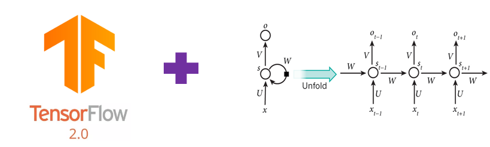

# Tensorflow 2 RNN-tutorial

  

- This repository is a tutorial for RNN model developers using Tensorflow.
- 이 tutorial은 tensorflow 1.x 용 [RNN Tutorial](https://github.com/hccho2/Tensorflow-RNN-Tutorial)을 Tensorflow 2에 맞게 수정한 것이다.
- 이 tutorial 코드를 실행하기 위해서는 Tensorflow 2.2.0, tensorflow_addons 0.10.0 필요
- TensorFlow SIG(Special Interest Group) [Addons](https://www.tensorflow.org/addons/overview?hl=ko)은 Tensorflow에서 사용할 수 없는 기능을 추가로 구현한 API를 모아놓은 것이다. 
- tensorflow 1.x 의 tensorflow.contrib.seq2seq는 tensorflow 2.x에서 tensorflow_addons.seq2seq로 변환되었다고 볼 수 있다.
- 여기서는 Addon중에서 RNN관련 API를 살펴볼 예정이다:
    * tfa.seq2seq.Sampler
    * tfa.seq2seq.BasicDecoder
    * tfa.seq2seq.dynamic_decode
    * tfa.seq2seq.BahdanauAttention, tfa.seq2seq.LuongAttention
- 또한, RNNCell, Sampler를 custumization하여 User Defined RNNCell, Sampler를 만들어 보자.

## 1. [Basic RNN Model](https://github.com/hccho2/Tensorflow-2-RNN-Tutorial/tree/master/0.%20Basic)
Tensorflow의 다음과 같은 API를 사용하여 기본적인 RNN 모델의 작동 원리를 알 수 있다.
- Tensorflow RNN 기초, Embedding, Multi Layer RNN
- Bidirectional RNN
- BasicDecoder, Sampler, dynamic_decode
- seq2seq(Encoder-Decoder), Attention

### 2. [User Defined RNNWrapper](https://github.com/hccho2/RNN-Tutorial/tree/master/1.%20RNNWrapper) 
- User Defined RNNCell

### 3. [User Defined Helper](https://github.com/hccho2/Tensorflow-RNN-Tutorial/tree/master/2.%20User%20Defined%20Helper)

### 4. [User Defined Decoder](https://github.com/hccho2/Tensorflow-RNN-Tutorial/tree/master/3.%20User%20Defined%20Decoder)

### 5. [Attention with Tensorflow](https://github.com/hccho2/Tensorflow-RNN-Tutorial/tree/master/4.%20Attention%20with%20Tensorflow)
